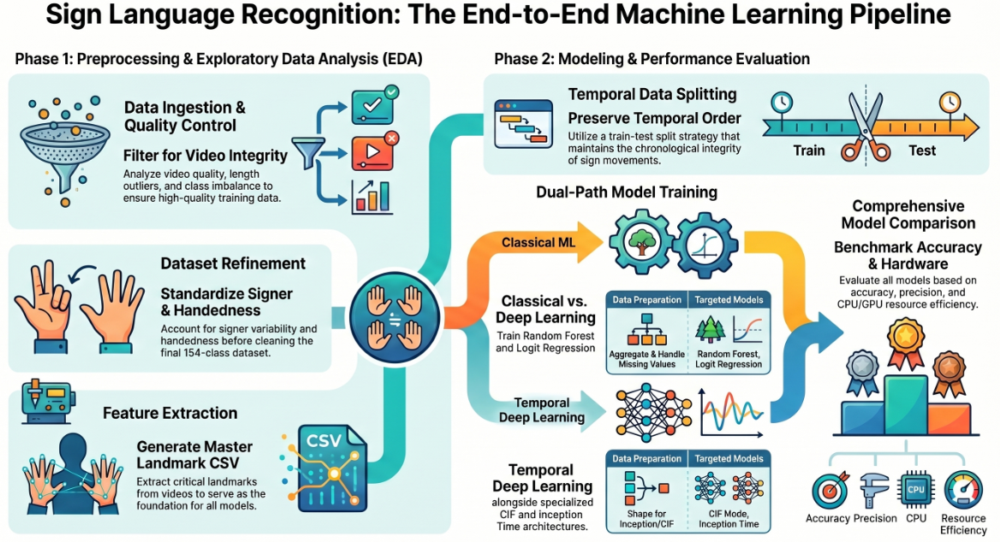

# OBrown_DIS9300A_v1_ASLR

**Dissertation project repository — National University, 2025**
Researcher: O. Brown | Course: DIS 9300

---

## Pipeline Overview

---

## Repository Structure

| Folder | Contents |
|---|---|
| `notebooks/` | Jupyter notebooks for all analysis stages |
| `results/` | End-point outputs (figures, tables, exports) |
| `data/` | Raw and processed datasets |

---

*Note: Data files over 50MB are excluded due to GitHub size limits.*
